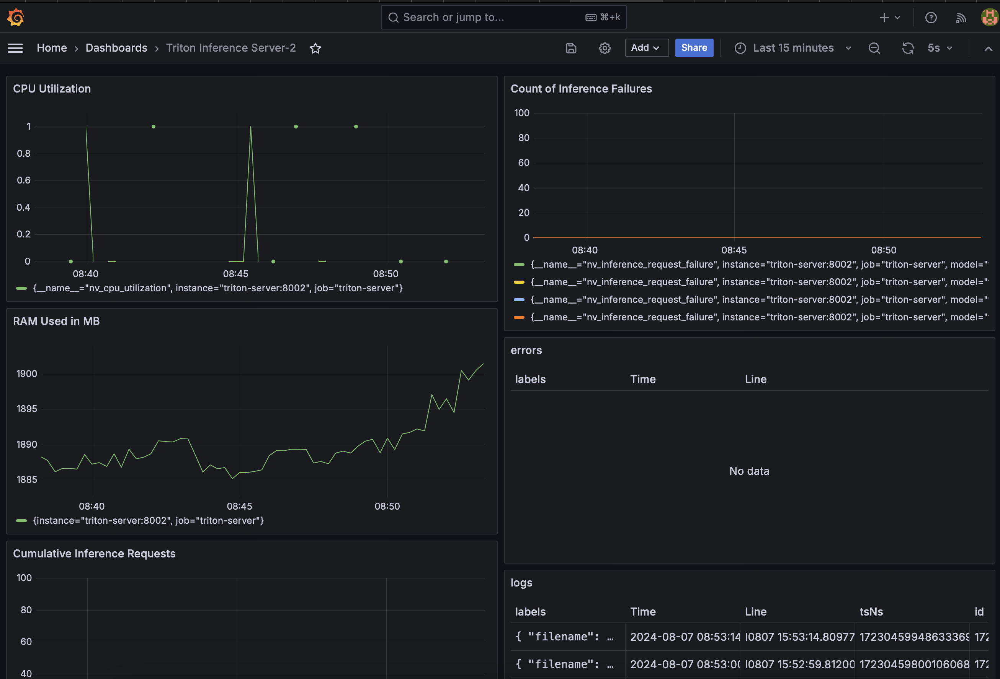

This repository guides you for deploying transformer models using NVIDIA's Triton Inference Server. It includes scripts for converting models and setting up a monitoring environment with Prometheus, Grafana, and Loki.

**Triton Inference Server:** Serves models efficiently.

**Model Conversion:** Scripts to convert Hugging Face models to ONNX, ready for Triton.

**Observability:** Built-in with Prometheus, Grafana, and Loki for monitoring.

### Requirements

Make sure Docker, Docker Compose, and Python are installed on your system.

## Getting Started
Clone this repository and navigate to its directory. Start the setup with:

```bash
bash scripts/up.sh
```

This script will:

Convert a Hugging Face model to ONNX format.
Set up the Triton server and monitoring tools using Docker Compose.

**Testing the web server:**
Run `python demo/test-triton.py` to test the model on the Triton server.
Monitoring: Access Grafana at http://localhost:3000 for dashboards and Prometheus at http://localhost:9090 for metrics.

### Tech Stack Details

The system uses Docker Compose to run several services:

**Triton Server:** Hosts the AI model and handles requests for model predictions.

**Loki:** Collects and stores logs from the Triton server.

**Promtail:** Sends logs from the server to Loki.

**Prometheus:** Gathers and keeps track of performance metrics from the Triton server.

**Grafana:** Shows data from Prometheus and Loki in visual format for easy understanding and action.


## Setting Up Grafana Dashboards

Before you import the  `dashboard.json`  file into Grafana, you must configure the data sources for Prometheus and Loki.

### Setting Up Data Sources

1.  **Log into Grafana**:
    - visit `http://localhost:3000` the default admin password and username is used for the demo. they are both `admin`. Login to grafana and then you will be prompted to change password when you login. 
    -   Navigate to the  menu by selecting the hamburger icon on the left sidebar.
2.  **Add Data Source**:
    
    -   Click on "Data Sources".
    -   Click on “Add data source”.
3.  **Configure Prometheus**:
    
    -   Select "Prometheus" as the type.
    -   Set the URL to where your Prometheus server is running  `http://prometheus:9090`.
    -   Save and test the connection to ensure it's set up correctly.
4.  **Configure Loki**:
    
    -   Select "Loki" as the type.
    -   Set the URL to where your Loki server is running  `http://loki:3100`.
    -   Save and test the connection to confirm it works.

### Importing the Dashboard

1.  **Go to Create > Import**:
    
    -   Navigate to the "+" icon or "Create" menu on the left sidebar and select "Import".
2.  **Import the Dashboard**:
    
    -   Upload the  `grafana/dashboard.json`  file or paste the JSON directly into the import window.
3.  **Select Data Sources**:
    
    -   Choose the appropriate Prometheus and Loki data sources you set up earlier.
4.  **Save the Dashboard**:
    
    -   Save the new dashboard to view it.
It should look like this:


